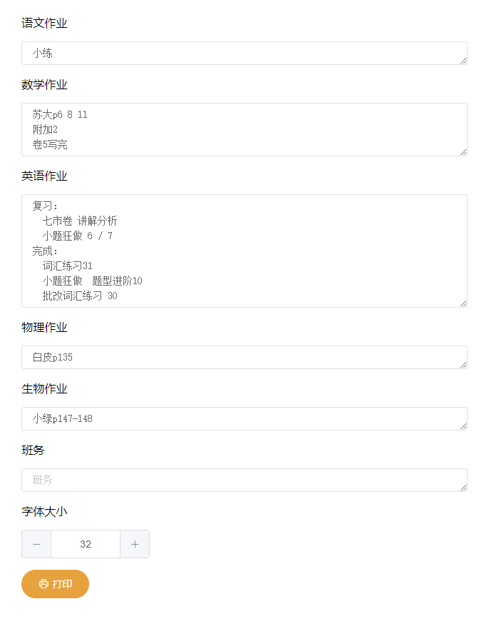

# 高三八班用户界面
这是我们班的智能系统界面代码，包含动态壁纸，作业编辑器和标语编辑器，使用 vue 编写。可以通过简单的适配在任何教室使用

后端运行 [C8API](https://github.com/clansty/c8api)，用于标语和作业的存取
## 运行效果


## 动态壁纸 wallpaper.html
运行效果图为动态壁纸界面，我们通过 Live2DViewerEx 加载动态壁纸。可以使用任何支持使用网页做壁纸的动态壁纸软件

### 高考倒计时
高考时间在 169 行定义
```js
var gaokaoDate = Date.parse("2020-7-7");
```

### 天气
天气使用和风天气的 H5 控件，采用 iframe 引入。

对 CSS 与 JS 进行了一些修改来适配显示样式

通过 citycode 定义苏州的天气，位于 82 行

### 课表
课表暂时写在 JS 里，位于 79 行附近

### API集成
标语与作业读取自 C8API

## 作业看板 homework.html


作业看板方便大屏显示所有作业，每秒自动刷新一次

支持调整字体大小和编辑。在编辑框打开时自动刷新会停止

## 作业编辑器 homeworkwireless.html


这个编辑器设计的初衷本来是给手机端使用的。当扩展桌面配置后开始用于主屏编辑作业副屏显示

已经加入编辑时自动保存功能

## 标语编辑器 slogan.html
用于编辑桌面中间的标语，得益于 vue 的绑定，支持实时预览